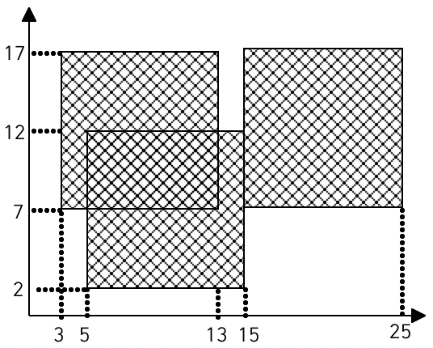

# 색종이

|시간 제한|	메모리 제한|	제출|	정답|	맞힌 사람|	정답 비율|
|---|---|---|---|---|---|
|1 초|	128 MB|	33618|	22601|	19225|	67.780%|

### 문제

가로, 세로의 크기가 각각 100인 정사각형 모양의 흰색 도화지가 있다. 이 도화지 위에 가로, 세로의 크기가 각각 10인 정사각형 모양의 검은색 색종이를 
색종이의 변과 도화지의 변이 평행하도록 붙인다. 이러한 방식으로 색종이를 한 장 또는 여러 장 붙인 후 색종이가 붙은 검은 영역의 넓이를 구하는 
프로그램을 작성하시오.



예를 들어 흰색 도화지 위에 세 장의 검은색 색종이를 그림과 같은 모양으로 붙였다면 검은색 영역의 넓이는 260이 된다.

### 입력

첫째 줄에 색종이의 수가 주어진다. 이어 둘째 줄부터 한 줄에 하나씩 색종이를 붙인 위치가 주어진다. 색종이를 붙인 위치는 두 개의 자연수로 주어지는데 첫 번째 자연수는 색종이의 왼쪽 변과 도화지의 왼쪽 변 사이의 거리이고, 두 번째 자연수는 색종이의 아래쪽 변과 도화지의 아래쪽 변 사이의 거리이다. 색종이의 수는 100 이하이며, 색종이가 도화지 밖으로 나가는 경우는 없다

### 출력

첫째 줄에 색종이가 붙은 검은 영역의 넓이를 출력한다.

### 예제 입력 1 

```
3
3 7
15 7
5 2
```

### 예제 출력 1 

```
260
```

### 출처

 - [백준 색종이 문제](https://www.acmicpc.net/problem/2563)

### 풀이 방식

- 메모리와 시간 모두 넉넉하기에 그냥 도화지를 직접 그리고 입력 받아서 바로 도화지에 하나하나 칠한다는 마음으로 for문을 이용하여 0으로 되어있는 도화지에 1로 설정하고, 만약 이미 1로 되어있으면 덧칠할 필요 없기에 if문을 이용하여 0일 때만 1로 칠하고 카운트(cnt)를 하나씩 더하고, 그 이외에는 전부 무시를 하는 식으로 푼다.

### 에러 발생 요인 

- 그냥 단순하게 종이 수 * 100 에다가 두장 씩 비교한 부분을 전부 빼다 보니 3장 이상 겹치는 상황에서는 중복으로 빠지게 된 것이다.

