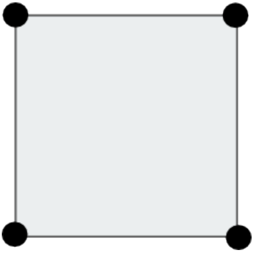
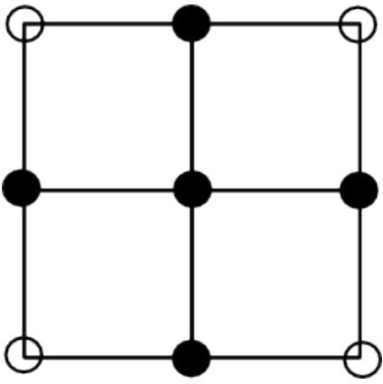
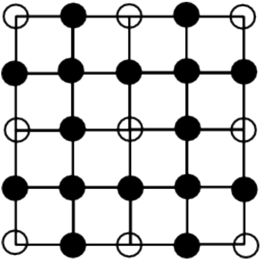

# 중앙 이동 알고리즘 다국어
 
|시간 제한|	메모리 제한|	제출|	정답|	맞힌 사람|	정답 비율|
|----|-------|------|---------|-----|---------|
|1 초|	128 MB|	8173|	5619|	5148|	69.371%|

### 문제

상근이는 친구들과 함께 SF영화를 찍으려고 한다. 이 영화는 외계 지형이 필요하다. 실제로 우주선을 타고 외계 행성에 가서 촬영을 할 수 없기 때문에, 컴퓨터 그래픽으로 CG처리를 하려고 한다.

외계 지형은 중앙 이동 알고리즘을 이용해서 만들려고 한다.

알고리즘을 시작하면서 상근이는 정사각형을 이루는 점 4개를 고른다. 그 후에는 다음과 같은 과정을 거쳐서 지형을 만든다.

정사각형의 각 변의 중앙에 점을 하나 추가한다.
정사각형의 중심에 점을 하나 추가한다.
초기 상태에서 위와 같은 과정을 한 번 거치면 총 4개의 정사각형이 새로 생긴다. 이와 같은 과정을 상근이가 만족할 때 까지 계속한다.

아래 그림은 과정을 총 2번 거쳤을 때까지의 모습이다.

||||
|-----------------|----------------|------------|
|초기 상태 - 점 4개|	1번 - 점 9개|	2번 - 25개|

상근이는 어떤 점은 한 개 보다 많은 정사각형에 포함될 수 있다는 사실을 알았다. 메모리 소모량을 줄이기 위해서 중복하는 점을 한 번만 저장하려고 한다. 과정을 N번 거친 후 점 몇 개를 저장해야 하는지 구하는 프로그램을 작성하시오.

### 입력

첫째 줄에 N이 주어진다. (1 ≤ N ≤ 15)

### 출력

첫째 줄에 과정을 N번 거친 후 점의 수를 출력한다.

### 예제 입력 1 

```
1
```

### 예제 출력 1 

```
9
```

### 예제 입력 2 

```
2
```

### 예제 출력 2 

```
25
```

### 예제 입력 3 

```
5
```

### 예제 출력 3 

```
1089
```

### 문제 출처

- [백준 중앙 이동 문제](https://www.acmicpc.net/problem/2903)

### 문제 풀이 방식

나는 이번 문제를 수학 적으로 접근하였는데 입력이 1이면 출력이 3의 제곱, 입력이 2이면 5의 제곱, 입력이 3이면 9의 제곱, 이런 식으로 어떤 값의 제곱이 답이 된다는 것을 볼 수 있는데 여기에서 이 어떤 값의 규칙성을 찾아보면 1일 때 3 , 2일 때 5 , 3일 때 9 , 4일 때 17 , 5일 때 33 으로 이 수들은 2의 N 제곱에 +1 한 것으로 사실 그냥 for 문으로 제곱을 해주어도 되지만, 학습하고자 제곱 함수인 pow를 이용하였다.
pow 함수를 사용하기 위해서는 `#include <cmath>` 를 포함하여야 하며 앞의 수를 뒤의 수만큼 제곱을 하는 것이다.
