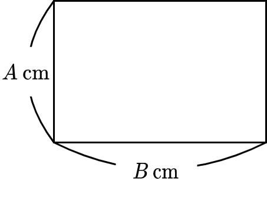

# 직사각형
 
|시간 제한|	메모리 제한|	제출|	정답|	맞힌 사람|	정답 비율|
|----------|---------|---------|-----|-----------|-----------|
|2 초|	1024 MB|	4591|	3984|	3843|	87.460%|

### 문제

정수 A, B 가 주어진다. 세로 길이가 A cm, 가로 길이가 B cm 인 아래와 같은 직사각형의 넓이를 cm2 단위로 구하시오.



### 입력

표준 입력에 다음과 같은 형태로 입력이 주어진다.

```
A
B
```

### 출력

세로 길이가 A cm, 가로 길이가 B cm인 직사각형의 넓이를 cm2 단위로 구하고, 단위 (cm2)를 생략하여 출력한다.

### 제한

- 1 ≦ A ≦ 100.
- 1 ≦ B ≦ 100.
- A, B 는 정수이다.

### 예제 입력 1 

```
2
3
```

### 예제 출력 1 

```
6
```

세로 길이가 2 cm, 가로 길이가 3 cm인 직사각형의 넓이는 6 cm2이므로, 6 을 출력한다.

### 예제 입력 2 

```
100
1
```

### 예제 출력 2 

```
100
```

### 예제 입력 3 

```
4
4
```

### 예제 출력 3 

```
16
```

### 문제 출처

- [백준 직사각형 문제](https://www.acmicpc.net/problem/27323)

### 문제 풀이 방식

두 수를 입력 받고, 그 두 수를 그대로 곱하여 출력하면 해결이다.
