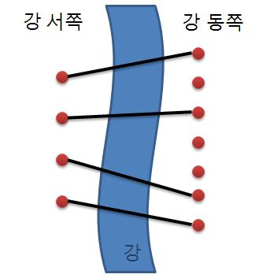

# 다리 놓기

|시간 제한|	메모리 제한|	제출|	정답|	맞힌 사람|	정답 비율|
|--------|-----------|--------|-------|-----------|-----------|
|0.5 초 (추가 시간 없음)|	128 MB|	76481|	35673|	29070|	48.344%|

### 문제

재원이는 한 도시의 시장이 되었다. 이 도시에는 도시를 동쪽과 서쪽으로 나누는 큰 일직선 모양의 강이 흐르고 있다. 하지만 재원이는 다리가 없어서 시민들이 강을 건너는데 큰 불편을 겪고 있음을 알고 다리를 짓기로 결심하였다. 강 주변에서 다리를 짓기에 적합한 곳을 사이트라고 한다. 재원이는 강 주변을 면밀히 조사해 본 결과 강의 서쪽에는 N개의 사이트가 있고 동쪽에는 M개의 사이트가 있다는 것을 알았다. (N ≤ M)

재원이는 서쪽의 사이트와 동쪽의 사이트를 다리로 연결하려고 한다. (이때 한 사이트에는 최대 한 개의 다리만 연결될 수 있다.) 재원이는 다리를 최대한 많이 지으려고 하기 때문에 서쪽의 사이트 개수만큼 (N개) 다리를 지으려고 한다. 다리끼리는 서로 겹쳐질 수 없다고 할 때 다리를 지을 수 있는 경우의 수를 구하는 프로그램을 작성하라.



### 입력

입력의 첫 줄에는 테스트 케이스의 개수 T가 주어진다. 그 다음 줄부터 각각의 테스트케이스에 대해 강의 서쪽과 동쪽에 있는 사이트의 개수 정수 N, M (0 < N ≤ M < 30)이 주어진다.

### 출력

각 테스트 케이스에 대해 주어진 조건하에 다리를 지을 수 있는 경우의 수를 출력한다.

### 예제 입력 1 

```
3
2 2
1 5
13 29
```

### 예제 출력 1 

```
1
5
67863915
```

### 문제 출처

- [백준 다리 놓기 문제](https://www.acmicpc.net/problem/1010)

### 문제 풀이 방식

수학적으로 접근하였을 때, 경우의 수를 계산하는 것은 M!(팩토리얼) 나누기 N!, 나누기 (M-N)! 이지만, M! 나누기 (M-N)!을 하면 (M-N+1) 부터 M 까지의 곱에 N! 을 나눈 것이다.
하지만 팩토리얼을 다 계산하고 하면 값이 너무 커지는 상황이 발생할 수 있어 미리미리 나누어 가면서 계산해줘야 하는데, 분수로 봤을 때 분자에는 M 부터 해서 (M-N+1) 까지 곱해갈 때 분모는 1부터 N 까지 곱하는 것으로 순서가 이루어지는 것으로 바로바로 분자에 분모를 나누는 방식을 진행하여 해결을 봤다.
