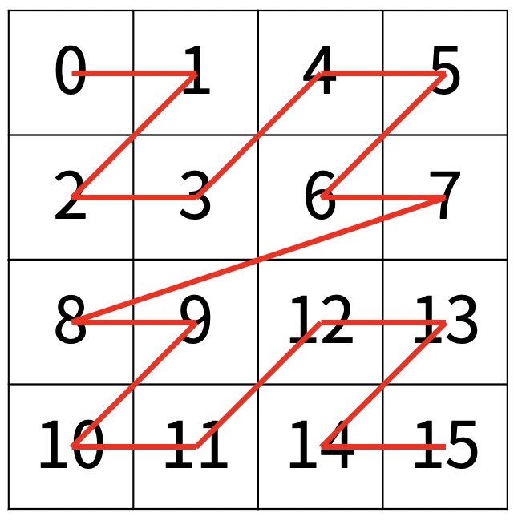

# Z
 
|시간 제한|	메모리 제한|	제출|	정답|	맞힌 사람|	정답 비율|
|---------------------|---------|------|--------|-----|-----------|
|0.5 초 (추가 시간 없음)|	512 MB|	75356|	30377|	22747|	40.852%|

### 문제

한수는 크기가 2N × 2N인 2차원 배열을 Z모양으로 탐색하려고 한다. 예를 들어, 2×2배열을 왼쪽 위칸, 오른쪽 위칸, 왼쪽 아래칸, 오른쪽 아래칸 순서대로 방문하면 Z모양이다.


N > 1인 경우, 배열을 크기가 2N-1 × 2N-1로 4등분 한 후에 재귀적으로 순서대로 방문한다.

다음 예는 22 × 22 크기의 배열을 방문한 순서이다.



N이 주어졌을 때, r행 c열을 몇 번째로 방문하는지 출력하는 프로그램을 작성하시오.

다음은 N=3일 때의 예이다.


### 입력

첫째 줄에 정수 N, r, c가 주어진다.

### 출력

r행 c열을 몇 번째로 방문했는지 출력한다.

### 제한

- 1 ≤ N ≤ 15
- 0 ≤ r, c < 2N

### 예제 입력 1 

```
2 3 1
```

### 예제 출력 1 

```
11
```

### 예제 입력 2 

```
3 7 7
```

### 예제 출력 2 

```
63
```

### 예제 입력 3 

```
1 0 0
```

### 예제 출력 3 

```
0
```

### 예제 입력 4 

```
4 7 7
```

### 예제 출력 4 

```
63
```

### 예제 입력 5 

```
10 511 511
```

### 예제 출력 5 

```
262143
```

### 예제 입력 6 

```
10 512 512
```

### 예제 출력 6 

```
786432
```

### 출처

- [백준 Z](https://www.acmicpc.net/problem/1074)

### 문제 풀이 방식

Z의 형태를 2의 제곱수마다 표현이 되는 것으로 Z의 형태는 4개씩 묶음이 되는 성질과 vector의 선입후출(먼저 집어 넣은 값은 나중에 나오는 성질)을 이용하고 다시 몇번째 Z에 들어있는지 하나씩 확인하면서 숫자를 찾아가면 최종 값을 찾게되면 해결이다.
