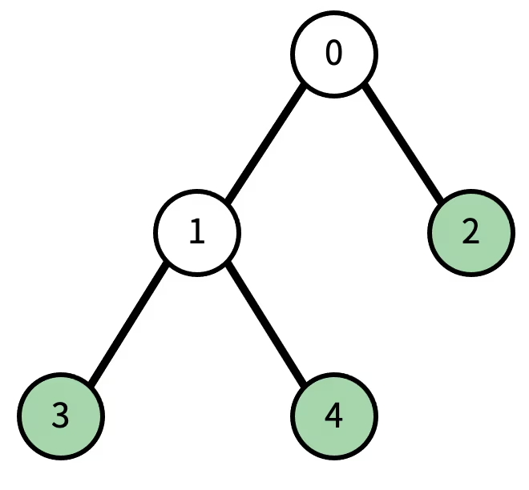
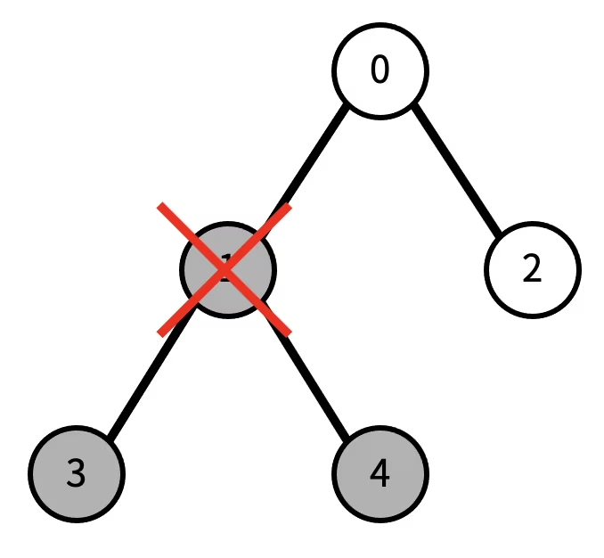

# 트리
 
|시간 제한|	메모리 제한|	제출|	정답|	맞힌 사람|	정답 비율|
|----|--------|------|-------|-------|--------|
|2 초|	128 MB|	59761|	17624|	13310|	28.963%|

## 문제

트리에서 리프 노드란, 자식의 개수가 0인 노드를 말한다.

트리가 주어졌을 때, 노드 하나를 지울 것이다. 그 때, 남은 트리에서 리프 노드의 개수를 구하는 프로그램을 작성하시오. 노드를 지우면 그 노드와 노드의 모든 자손이 트리에서 제거된다.

예를 들어, 다음과 같은 트리가 있다고 하자.



현재 리프 노드의 개수는 3개이다. (초록색 색칠된 노드) 이때, 1번을 지우면, 다음과 같이 변한다. 검정색으로 색칠된 노드가 트리에서 제거된 노드이다.



이제 리프 노드의 개수는 1개이다.

## 입력

첫째 줄에 트리의 노드의 개수 N이 주어진다. N은 50보다 작거나 같은 자연수이다. 둘째 줄에는 0번 노드부터 N-1번 노드까지, 각 노드의 부모가 주어진다. 만약 부모가 없다면 (루트) -1이 주어진다. 셋째 줄에는 지울 노드의 번호가 주어진다.

## 출력

첫째 줄에 입력으로 주어진 트리에서 입력으로 주어진 노드를 지웠을 때, 리프 노드의 개수를 출력한다.

### 예제 입력 1 

```
5
-1 0 0 1 1
2
```

### 예제 출력 1 

```
2
```

### 예제 입력 2 

```
5
-1 0 0 1 1
1
```

### 예제 출력 2 

```
1
```

### 예제 입력 3 

```
5
-1 0 0 1 1
0
```

### 예제 출력 3 

```
0
```

### 예제 입력 4 

```
9
-1 0 0 2 2 4 4 6 6
4
```

### 예제 출력 4 

```
2
```

### 문제 출처

- [백준 트리 문제](https://www.acmicpc.net/problem/1068)

### 문제 풀이 방식

트리 구조를 보는 순간 전체 탐색과 깊이 탐색이 떠올랐는데, 나는 전체 탐색을 기준으로 풀이를 하였다.
먼저 vector 구조로 입력을 받고, 삭제할 노드는 N의 값이 50까지 밖에 안되기에 해당 자리의 노드를 그보다 큰 수인 55로 바꿔줌으로써 삭제됨을 표현하였다.
또한 삭제된 노드의 하위 노드들도 마찬가지로 삭제해주기 위해(값을 55로 바꿔주기 위해) queue 를 통해 삭제된 노드에 연결된 바로 아래의 노드들을 삭제하고 다시 queue에 넣어주면서 또 그 노드들에 연결된 하위 노드들을 하나씩 삭제해준다.
마지막으로 가장 마지막 노드부터 탐색하여 해당 노드가 삭제되지 않았는지 확인하고, 하위 노드를 가지고 있는지 vector의 find 함수를 사용하여 찾아준 뒤 없을 경우 해당 노드가 리프 노드이기에 cnt를 하나씩 늘려가주고 cnt를 출력하면 해결이다.
