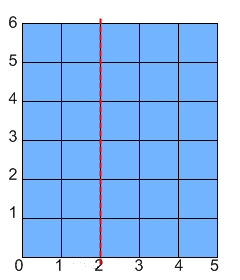
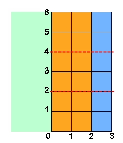
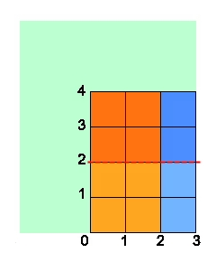
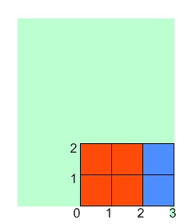
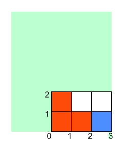
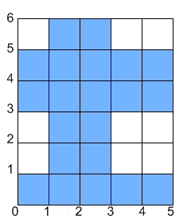

# 색칠 1
 
|시간 제한|	메모리 제한|	제출|	정답|	맞힌 사람|	정답 비율|
|----|-------|-----|------|---------|--------|
|2 초|	128 MB|	2147|	634|	477|	31.095%|

## 문제

지민이는 종이에 색칠하기를 좋아한다. 지민이는 W×H 크기의 직사각형 종이를 가지고 있다. 지민이는 종이에 다음과 같이 색칠 하려고 한다.

1. 종이를 x = f에 맞춰서 접는다. 이때, 왼쪽 종이가 오른쪽 종이 위에 올라오게 접는다.
2. 종이를 가로로 c+1개의 크기가 동일 한 구간으로 나눈다. 그 다음에 c번 가장 위의 구간부터 차례대로 접는다.
3. 왼쪽 아래가 (x1, y1) 이고, 오른쪽 위가 (x2, y2)인 직사각형을 찾는다. 이때, (0, 0)은 현재 접힌 상태에서 가장 왼쪽 아래 점이다. 그 직사각형을 칠한다. 이때, 페인트는 겹쳐있는 모든 곳에 스며든다.
4. 종이를 편다.

다음 예는 5×6 종이에, x=2이고, c=2이고, (x1, y1) = (1, 1), (x2, y2) = (3, 2)인 경우이다.













W, H, f, c, x1, y1, x2, y2가 주어질 때, 색칠되어 있지 않은 면적을 구하는 프로그램을 작성하시오.

## 입력

첫째 줄에 8개의 정수 W, H, f, c, x1, y1, x2, y2가 주어진다.

## 출력

첫째 줄에 색칠되지 않은 영역의 넓이를 출력한다.

## 제한


- 1 ≤ W, H ≤ 109
- 0 ≤ f ≤ W
- 0 ≤ c ≤ 1,000
- c+1은 H의 약수
- 0 ≤ x1 < x2 ≤ max(f, W-f)
- 0 ≤ y1 < y2 ≤ H/(c+1)


### 예제 입력 1 

```
5 6 2 2 1 1 3 2
```

### 예제 출력 1 

```
21
```

### 예제 입력 2 

```
3 13 1 0 1 8 2 12
```

### 예제 출력 2 

```
35
```

### 예제 입력 3 

```
12 12 7 3 3 1 6 2
```

### 예제 출력 3 

```
124
```

### 예제 입력 4 

```
4 5 4 0 0 0 1 1
```

### 예제 출력 4 

```
19
```

### 예제 입력 5 

```
4 8 4 3 0 1 2 2
```

### 예제 출력 5 

```
24
```

### 예제 입력 6 

```
4 8 3 0 1 1 3 2
```

### 예제 출력 6 

```
30
```


### 문제 출처 

- [백준 색칠 1 문제](https://www.acmicpc.net/problem/1117)

### 문제 풀이 방식

우선 종이는 세로로 접는 것은 무조건 곱하기 (c + 1)번 접히기에 가로로 접는 것만 계산 한 뒤에 마지막에 (c + 1)만 곱하면 되는 것이다.

그렇다면 가로로 접는 경우의 수를 생각해야하는데 그 전에 어떻게 접어도 무조건 적으로 ((y2 - y1) * (x2 - x1))만큼은 무조건 적으로 색칠된다.

다음으로 f가 0이거나 W가 되면 조금도 접지 않고 그대로 두거나 뒤집기만 하는 것이기에 더하는 것 하나 없이 그대로 더해주면 된다.

그 외로 f가 0이나 W를 제외한 값일 경우 접힌 부분 중 작게 접힌 부분을 계산해야하는데, 만약에라도 (W - f)와 f가 같은 경우로 종이를 정확히 반으로 접을 때는 왼쪽과 오른쪽의 색칠된 부분이 같기에 그대로 곱하기 2를 해주면 된다.

이제 두 가지 경우의 수가 있는데, 첫번째로 왼쪽의 종이가 오른쪽 종이보다 작게 접히는 경우 왼쪽의 종이가 색칠된 부분을 계산해야한다.
여기에서도 세 가지 경우의 수가 있는데, 먼저 아예 안 묻는 경우인 x1이 f보다 크거나 같은 경우로 그대로 넘어가고, f가 x2보다 크거나 같은 경우 왼쪽 종이도 오른쪽 종이처럼 색칠된 부분이 전부 종이의 범위에 포함되기에 곱하기 2를 해주고, 마지막으로 나머지 경우인 왼쪽 종이가 색칠된 범위의 일부만 곂치는 경우로 곂치는 부분만 계산하여 더해주면 된다.
다음으로 왼쪽 종이가 오른쪽 종이보다 큰 경우에도 위와 같이 세 가지 경우의 수로 이루어지는데 각각의 경우대로 계산해준다.
최종으로 세로로 접은 횟수인 (c + 1)을 곱해준 뒤, 전체 종이의 수에서 색칠된 만큼만 빼 주면 해결이다.

### WARNING

W와 H의 최댓값이 10^9으로 둘을 곱한 값은 int 와 long long의 범위를 벗어난다. 고로 음수가 나오는 경우가 없기에 unsigned long long으로 범위를 늘려서 진행하게 되면 문제를 풀수 있게 된다. 또한 메모리 제한도 128MB이기에 충분한 상황이다.
