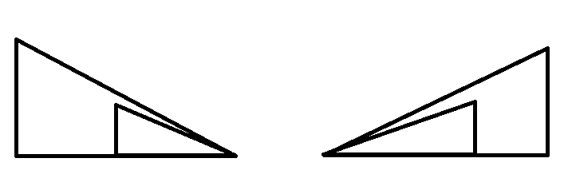

# 고층 건물
 
시간 제한	메모리 제한	제출	정답	맞힌 사람	정답 비율
2 초	128 MB	10973	4833	4179	47.114%

## 문제

세준시에는 고층 빌딩이 많다. 세준시의 서민 김지민은 가장 많은 고층 빌딩이 보이는 고층 빌딩을 찾으려고 한다. 빌딩은 총 N개가 있는데, 빌딩은 선분으로 나타낸다. i번째 빌딩 (1부터 시작)은 (i,0)부터 (i,높이)의 선분으로 나타낼 수 있다. 고층 빌딩 A에서 다른 고층 빌딩 B가 볼 수 있는 빌딩이 되려면, 두 지붕을 잇는 선분이 A와 B를 제외한 다른 고층 빌딩을 지나거나 접하지 않아야 한다. 가장 많은 고층 빌딩이 보이는 빌딩을 구하고, 거기서 보이는 빌딩의 수를 출력하는 프로그램을 작성하시오.

## 입력

첫째 줄에 빌딩의 수 N이 주어진다. N은 50보다 작거나 같은 자연수이다. 둘째 줄에 1번 빌딩부터 그 높이가 주어진다. 높이는 1,000,000,000보다 작거나 같은 자연수이다.

## 출력

첫째 줄에 문제의 정답을 출력한다.

### 예제 입력 1 

```
15
1 5 3 2 6 3 2 6 4 2 5 7 3 1 5
```

### 예제 출력 1 

```
7
```

### 예제 입력 2 

```
1
10
```

### 예제 출력 2 

```
0
```

### 예제 입력 3 

```
4
5 5 5 5
```

### 예제 출력 3 

```
2
```

### 예제 입력 4 

```
5
1 2 7 3 2
```

### 예제 출력 4 

```
4
```

### 예제 입력 5 

```
10
1000000000 999999999 999999998 999999997 999999996 1 2 3 4 5
```

### 예제 출력 5 

```
6
```

### 문제 출처

- [백준 고층 건물 문제](https://www.acmicpc.net/problem/1027)

### 문제 풀이 방식

여러분은 저처럼 int에서 double로 바꿔서 진행할 때 놓치는 것은 없는지 확인하는 과정을 반드시 거쳐가주세요 (틀린 겨우 중간에 타입 하나를 int 상태로 했다가 오류 잡는데 이틀 걸렸습니다....)
우선 아래 사진과 같은 형태의 삼각형을 생각하면서 각각의 if 문으로 구분 지어서 문제를 풀었습니다. 



먼저 문제에서의 건물 A를 main으로, 건물 B를 target으로 명시하고 check에 해당하는 건물들은 건물 A와 B 사이의 건물들로 기울기를 계산하여 하나라도 건물 B를 가리는 것이 있으면 해당 건물은 fail임을 지정하여 카운트에서 제외하고 건물 B가 가려지지 않는 경우에만 카운트를 더하는 방식으로 진행하였다. 
기울기의 계산은 a와 좌표와 b의 좌표에서 (b의 y좌표 - a의 y좌표) / (b의 x좌표 - a의 x좌표)를 통해 계산하고, 위의 그림처럼 삼각형이 이루어졌다고 생각하면서 해당 문제를 풀었습니다.
