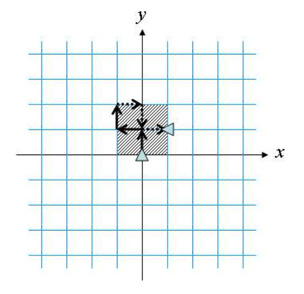

# 거북이
 
|시간 제한  |	메모리 제한 |	제출    |	정답    |	맞힌 사람   |	정답 비율|
|-------|-----------|-------|------|------|---------|
|1 초	|128 MB		|6559	|3633	|2720	|53.925%|

## 문제

상근이는 2차원 평면 위에서 움직일 수 있는 거북이 로봇을 하나 가지고 있다. 거북이 로봇에게 내릴 수 있는 명령은 다음과 같이 네가지가 있다.


1. F: 한 눈금 앞으로
2. B: 한 눈금 뒤로
3. L: 왼쪽으로 90도 회전
4. R: 오른쪽으로 90도 회전

L과 R명령을 내렸을 때, 로봇은 이동하지 않고, 방향만 바꾼다. 명령을 나열한 것을 거북이 로봇의 컨트롤 프로그램이라고 한다.

상근이는 자신의 컨트롤 프로그램으로 거북이가 이동한 영역을 계산해보려고 한다. 거북이는 항상 x축과 y축에 평행한 방향으로만 이동한다. 거북이가 지나간 영역을 모두 포함할 수 있는 가장 작은 직사각형의 넓이를 구하는 프로그램을 작성하시오. 단, 직사각형의 모든 변은 x축이나 y축에 평행이어야 한다.

아래 그림에서 거북이는 가장 처음에 (0, 0)에 있고, 북쪽을 쳐다보고 있다. 컨트롤 프로그램이 FLFRFLBRBLB인 경우에 거북이는 아래와 같이 움직인다. 회색으로 빗금친 부분이 거북이가 지나간 영역을 모두 포함할 수 있는 가장 작은 직사각형이다. 넓이는 4가 된다.



거북이가 지나간 영역이 직사각형을 만들지 않는 경우도 있다. 예를 들어, FFLLFF인 경우에 거북이는 y축의 위로만 지나다닌다. 이 경우에 거북이가 지나간 영역을 모두 포함하는 직사각형은 선분이고, 선분은 한 변이 0인 직사각형으로 생각할 수 있다. 따라서, 선분의 경우에 넓이는 0이 된다.

## 입력

첫째 줄에 테스트 케이스의 개수 T가 주어진다. 각 테스트 케이스는 한 줄로 이루어져 있고, 컨트롤 프로그램이 주어진다. 프로그램은 항상 문제의 설명에 나와있는 네가지 명령으로만 이루어져 있고, 길이는 500을 넘지 않는다. 

## 출력

각 테스트 케이스에 대해서, 거북이가 이동한 영역을 모두 포함하는 가장 작은 직사각형의 넓이를 출력한다.

### 예제 입력 1 

```
3
FFLF
FFRRFF
FFFBBBRFFFBBB
```

### 예제 출력 1 

```
2
0
9
```

### 문제 출처

- [백준 거북이 문제](https://www.acmicpc.net/problem/8911)

### 문제 풀이 방식

단순 무식하게 전방을 0이면 위, 1이면 오른쪽, 2이면 아래, 3이면 왼쪽으로 정하고 명령의 길이가 500을 넘지 않는다니 500이상인 수 중에 4의 배수인 500을 기준으로 두고 시작했다.
만약 입력받은 문자가 L이면 반시계 방향으로 도는 것이니 전방을 나타내는 수인 fro에 -1을, R이면 시계 방향으로 도는 것이니 fro에 +1을 하는 것으로 지정했다.
입력받은 문자가 F와 B일 경우에는 전방이 4가지 밖에 없기에 그냥 if문으로 직접 지정해주면서 이동된 위치의 좌표를 계산하고, 해당 X, Y 좌표의 최대, 최소를 각각 저장하고 마지막에 해당 값을 활용하여 계산하면 해결이다.
