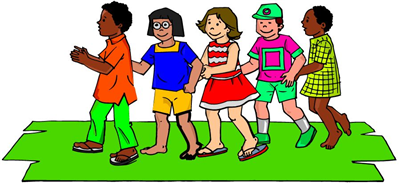

# 결혼식
 
|시간 제한| 메모리 제한| 제출| 정답| 맞힌 사람| 정답 비율|
|-|-|-|-|-|-|
|2초| 128 MB| 385| 121| 91|	32.042%|

## 문제

오늘은 기쁜 날이다. 개미와 코끼리의 결혼식 날이기 때문이다. 결혼 축하 의식으로 기차놀이를 하기로 했다. 기차놀이란 뒷사람이 앞사람의 어깨에 손을 얹고 한 줄로 마을을 돌아다니는 것이다. 그런데 앞사람과 뒷사람의 키 차이가 많이 나면 기차가 아름다워 보이지 않는다. 아름다움을 중요시 여기는 “앙두레 강”은 기차가 아름답게 보이도록 기차에서 사람들의 순서를 잘 조정하기로 했다.

인접한 앞뒤사람의 키 차이를 모두 더한 것이 최소가 될 때 기차는 가장 아름답게 보인다.

하지만 한 가지 문제가 있다. 결혼식에 사자가족도 참석했는데 사자가족은 서열이 엄격해서 서열이 낮은 사자가 서열이 높은 사자보다 기차에서 앞쪽에 위치하면 안 된다. 이 조건만 만족한다면 결혼식에 참석한 사람들의 순서를 마음대로 바꾸어도 된다.



“앙두레 강”을 도와 결혼 축하 기차를 아름답게 만들어 보도록 하자.

## 입력

첫 줄에 N(1 ≤ N ≤ 10000)과 K(1 ≤ K ≤ N, K ≤ 1000)가 입력된다. N은 결혼식에 참가한 사람의 수이고 K는 결혼식에 참가한 사자가족의 수이다. 바로 이어서 (우선순위가 높은 사자부터) 사자가족의 키가 K줄에 걸쳐 입력된다. 그리고 그 다음 줄부터 (N-K)줄에 다른 사람들의 키가 입력된다. 키는 231-1보다 작거나 같은 자연수이다.

## 출력

기차에서 인접한 앞뒤사람의 키 차이를 모두 더한 값을 출력하시오. 답은 231-1를 넘지 않는다.


### 예제 입력 1

```
5 3
1900
1300
1500
1200
1600
```

### 예제 출력 1

```
1000
```

### 예제 입력 2

```
3 2
2000
1200
1500
```

### 예제 출력 2

```
800
```

### 예제 입력 3

```
6 3
1700
1900
1500
1800
1750
1300
```

### 예제 출력 3

```
800
```

## 문제 출처

- [백준 결혼식 문제](https://www.acmicpc.net/problem/2317)

## 문제 풀이 방식

순서가 고정된 사자들 사이의 인접한 키 차이를 모두 합산하여 기본 최소 비용을 구합니다.
사자들의 키 범위(minL ~ maxL)에 포함되는 일반인들은 비용 증가 없이 배치가 가능하므로 무시합니다.
범위를 벗어나는 전역 최솟값과 최댓값은 맨 앞, 맨 뒤, 혹은 중간 사자 옆(왕복) 중 비용이 가장 적게 드는 위치를 선택해 합산합니다.
